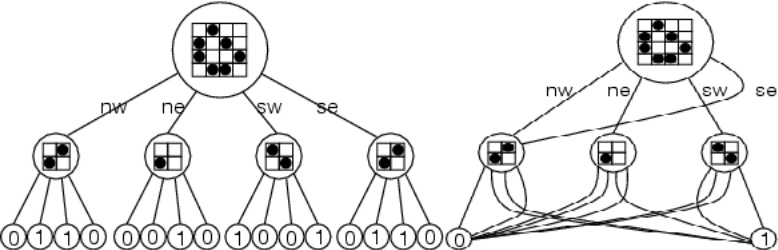
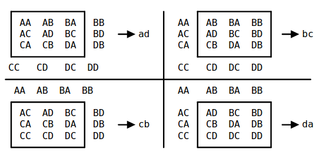
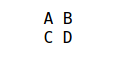
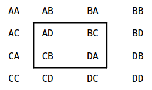
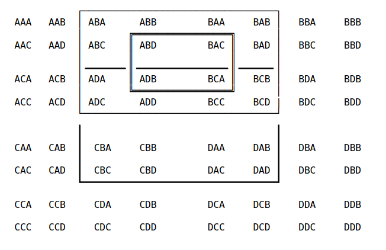
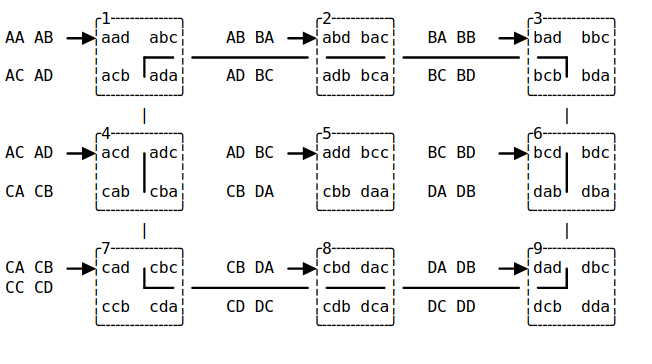

# Conways-Game-of-Life
Conways game of life is a cellular automaton game driven by the following rules
* Any live cell with two or three live neighbours survives.
*  Any dead cell with three live neighbours becomes a live cell.
*  All other live cells die in the next generation. Similarly, all other dead cells stay dead.

which translates to:
* Any cell with three neighbours is alive
* Any live cell with two neighbours is survives

## Algorithms
### Vanilla Algorithm
In the vanilla aglorithm we just iteratively calculate the neighbours and apply the rules to see if a cell survives or dies. The function ` vanilla_algo ` works in single steps in the above manner to propagate through the game.

### HashLife
Hashlife is the most efficient algorithm designed to handle Conways game of life. It uses caching and quadtrees to cache the state of the various formations in the lifetime of the game thus drastically reduing processing power required. It is intially slow initially whiie building the quad tree but its speed explodes aswe move forward.

#### Explanation
* We first convert the input to a list of points containg 'on'
* These ponts are converted to a qudtree data structure using `construct`
* The node is padded with 'off' outside.
* Each node in the quadtree consists of 4 children with the entire map as a single node at the top.
* The `join` function joins 4 nodes into a single node recursively whilst caching to reduce computation(using `lru_cache`)
* We apply the conway rule to a 4x4 block. Each 4x4 block can be split into4 3x3 blocs. Using this we can get the next iteration of the interior of the 3x3 block.(`life` and `life_4x4` used)

* We can now use `successor` to iterate over the top node recursively unile we reach a 4*4 arrangement when we can apply the `life` function to calculate the next step. The hashlife algorithm is known for its speed in calculating 2^k-2(k is the level of the top node) steps forward. We can calculate for smaller steps by braking the number of steps into binary and getting the maximum speed for subnodes where k is smaller.
<!-- * The images below show how we break a node into 4 ([A B C D]) and calculate the next iteration of the central 4x4 block recursively.

  
  -->

## Usage
` python conway.py <breeder_path> --skip=1 --sleep=0 --vanilla `