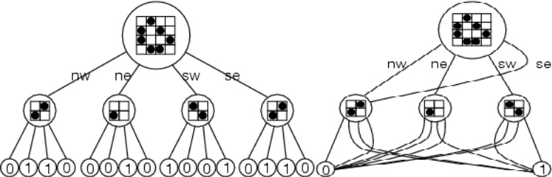

# Conways-Game-of-Life
Conways game of life is a cellular automaton game driven by the following rules
* Any live cell with two or three live neighbours survives.
*  Any dead cell with three live neighbours becomes a live cell.
*  All other live cells die in the next generation. Similarly, all other dead cells stay dead.

## Algorithms
### Vanilla Algorithm
In the vanilla aglorithm we just iteratively calculate the neighbours and apply the rules to see if a cell survives or dies. The function ` baseline_life ` works in single steps in the above manner to propagate through the game.

### HashLife
Hashlife is the most efficient algorithm designed to handle Conways game of life. It uses caching and quadtrees to cache the state of the various formations in the lifetime of the game thus drastically reduing processing power required. It is intially slow initially whiie building the quad tree but its speed explodes aswe move forward.

